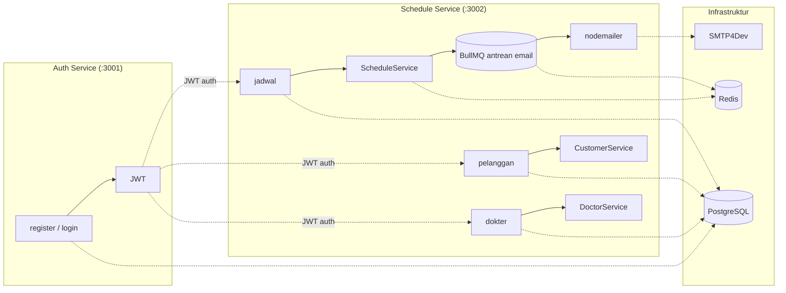

# Healthcare Scheduling

Monorepo mikroservis untuk manajemen janji temu kesehatan. Dibangun dengan NestJS v11, GraphQL, Prisma ORM, Redis, dan PostgreSQL.

[🇬🇧 English](./README.md)

## Layanan

| Layanan | Deskripsi | README |
|---|---|---|
| **Schedule Service** | Manajemen janji temu — pelanggan, dokter, jadwal, notifikasi email | [English](./schedule-service/README.md) · [Indonesia](./schedule-service/README-ID.md) |
| **Auth Service** | Autentikasi — registrasi pengguna, login, validasi JWT | [English](./auth-service/README.md) · [Indonesia](./auth-service/README-ID.md) |

## Mulai Cepat

```bash
# Salin environment
cp .env.example .env

# Jalankan infrastruktur
podman compose up -d postgresql redis smtp4dev adminer redis-commander

# Jalankan migrasi
podman compose run --rm migrate-auth-service
podman compose run --rm migrate-schedule-service

# Jalankan layanan
podman compose up -d auth-service schedule-service
```

## Arsitektur



- **Auth Service**: Registrasi/login pengguna, pembuatan dan validasi JWT
- **Schedule Service**: CRUD pelanggan/dokter/jadwal, paginasi, caching, notifikasi email via BullMQ

## Prasyarat

- Node.js 22+
- pnpm
- podman (atau docker)
- PostgreSQL 17
- Redis 7

## Lingkungan

Lihat `.env.example` di root proyek. Setiap layanan juga memiliki file `.env` sendiri dengan pengaturan spesifik layanan.

Variabel bersama utama:

| Variabel | Default | Deskripsi |
|---|---|---|
| `JWT_SECRET` | `change-this-...` | Rahasia untuk JWT pengguna |
| `INTERNAL_JWT_SECRET` | `change-this-...` | Rahasia untuk JWT layanan-ke-layanan |
| `MAIL_HOST` | `smtp4dev` | Server SMTP (kontainer smtp4dev) |

## Pengembangan

```bash
# Install dependensi (semua layanan)
cd schedule-service && pnpm install
cd auth-service && pnpm install

# Jalankan tes
cd schedule-service && pnpm test    # 45 tes
cd auth-service && pnpm test        # 14 tes

# Format kode
cd schedule-service && pnpm format
cd auth-service && pnpm format
```

## Alat Bantu

| Alat | URL | Kegunaan |
|---|---|---|
| Adminer | `http://localhost:8080` | UI PostgreSQL |
| Redis Commander | `http://localhost:8081` | UI Redis |
| SMTP4Dev | `http://localhost:5000` | Pratinjau email (menangkap semua email keluar) |

## Postman

Import `postman_collection.json` ke Postman untuk koleksi API lengkap semua layanan.
