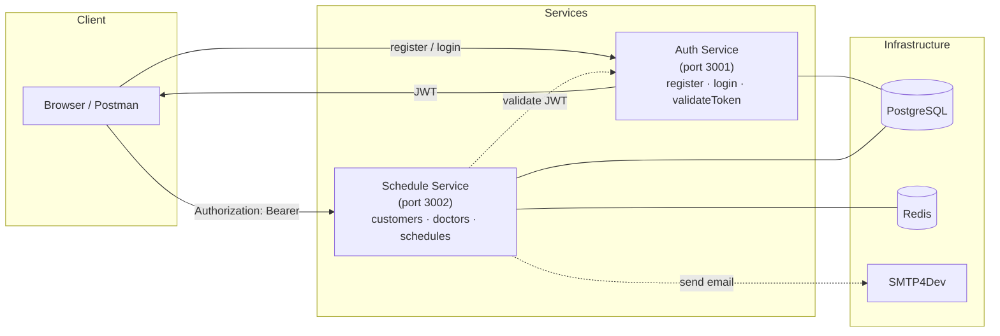

# Healthcare Scheduling

Microservices monorepo for managing healthcare appointments. Built with NestJS v11, GraphQL, Prisma ORM, Redis, and PostgreSQL.

[🇮🇩 Bahasa Indonesia](./README-ID.md)

## Services

| Service | Description | README |
|---|---|---|
| **Schedule Service** | Appointment management — customers, doctors, schedules, email notifications | [English](./schedule-service/README.md) · [Indonesia](./schedule-service/README-ID.md) |
| **Auth Service** | Authentication — user registration, login, JWT validation | [English](./auth-service/README.md) · [Indonesia](./auth-service/README-ID.md) |

## Quick Start

```bash
# Copy environment
cp .env.example .env

# Start infrastructure
podman compose up -d postgresql redis smtp4dev adminer redis-commander

# Run migrations
podman compose run --rm migrate-auth-service
podman compose run --rm migrate-schedule-service

# Start services
podman compose up -d auth-service schedule-service
```

## Architecture



- **Auth Service**: User registration/login, JWT generation and validation
- **Schedule Service**: Customer/doctor/schedule CRUD, pagination, caching, email notifications via BullMQ

## Prerequisites

- Node.js 22+
- pnpm
- podman (or docker)
- PostgreSQL 17
- Redis 7

## Environment

See `.env.example` at the project root. Each service also has its own `.env` file with service-specific overrides.

| Variable | Required | Default | Description |
|---|---|---|---|
| `COMPOSE_PROJECT_NAME` | no | `hss` | Docker Compose project prefix |
| `POSTGRES_PORT` | no | `5432` | PostgreSQL port (compose) |
| `POSTGRES_USER` | no | `postgres` | PostgreSQL user (compose) |
| `POSTGRES_PASSWORD` | no | `postgres` | PostgreSQL password (compose) |
| `REDIS_PORT` | no | `6379` | Redis port (compose) |
| `REDIS_PASSWORD` | no | — | Redis password |
| `REDIS_DB` | no | `0` | Redis database index |
| `REDIS_URL` | no | `redis://localhost:6379/0` | Redis connection string (derived from above) |
| `JWT_SECRET` | yes | — | Secret for user-facing JWTs (Auth Service) |
| `INTERNAL_JWT_SECRET` | yes | — | Shared secret for service-to-service JWTs |
| `MAIL_HOST` | no | `smtp4dev` | SMTP server |
| `MAIL_PORT` | no | `25` | SMTP port (compose) |
| `MAIL_USER` | no | — | SMTP user (optional) |
| `MAIL_PASSWORD` | no | — | SMTP password (optional) |
| `MAIL_FROM` | no | `noreply@example.com` | Default sender address |

`REDIS_URL` is a convenience variable constructed from `REDIS_HOST`, `REDIS_PORT`, and `REDIS_DB`. The services read individual fields (`REDIS_HOST`, `REDIS_PORT`, etc.) directly, not `REDIS_URL`.
## Development

```bash
# Install dependencies (all services)
cd schedule-service && pnpm install
cd auth-service && pnpm install

# Run tests
cd schedule-service && pnpm test    # 45 tests
cd auth-service && pnpm test        # 14 tests

# Format code
cd schedule-service && pnpm format
cd auth-service && pnpm format
```

## Tools

| Tool | URL | Purpose |
|---|---|---|
| Adminer | `http://localhost:8080` | PostgreSQL UI |
| Redis Commander | `http://localhost:8081` | Redis UI |
| SMTP4Dev | `http://localhost:5000` | Email preview (catches all outgoing mail) |

## Postman

Import `postman_collection.json` into Postman for the full API collection covering all services.
